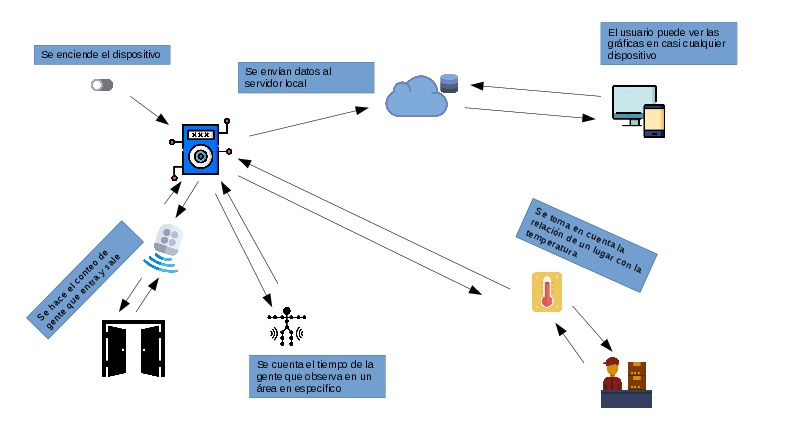

--------------------------------
#  Sistema Estadístico de Marketing

Autores
--------
* José Martín Ruíz Coss
* Alejandra Malacara Ávila
* Juan Silvestre Ramírez Becerra

### Descripción del proyecto 
El siguiente proyecto tiene como fin ofrecer una alternativa para la creación de ofertas en un centro comercial a través de la detección del comportamiento de las personas en base a la distribución de distintas áreas que están repartidas en un centro comercial, para ser específico, se tomará en cuenta el tráfico de personas que fluye por las distintas entradas (que también fungen como salidas) así como la temperatura y el tiempo de “observación” de productos por parte de los visitantes. Todo esto con el propósito de hacer gráficas de barra por día, semana, mes y año en base a los departamentos que tengan el dispositivo instalado, estas gráficas  podrán ser consultadas vía  web en cualquier momento por medio de una página web, ya que la información recaudada será enviada a una base de datos que estará localmente en la red del centro comercial y de esta manera se podrán enfocar las ofertas en áreas, entradas o zonas en específico. Cabe recalcar que para que el proyecto funcione como debería se tiene contar con varias placas Arduino que cumplan con los materiales listados abajo, si se coloca el dispositivo lejos de una entrada sólo será necesario cargar la versión sin detector de tráfico de visitantes.

### Requisitos
* Servidor con PHP 7.2.12 o superior, MySQL o MariaDB y Apache
(XAMPP o LAMP son una buena opción)

* Navegador WEB con ECMAScript 2018 (ver. 9)
(chrome ver. 68 u Opera ver.47  son buena opción)

### Materiales:
* Protoboard
* Arduino UNO
* Sensor de humedad y temperatura
* Sensor ultrasónico
* Sensor infrarrojo
* Botón
* Cable USB A USB tipo B
* Ethernet shield w5100
* Cable ethernet

### Software usado
* Atom
* Brackets
* Arduino IDE
* Librerías utilizadas
* Ethernet.h
* SPI.h
* Time.h
* Bootstrap 4
* Chart.js

### Puertos y Protocolos de comunicación
* HTTP (puerto 80)
* TCP

### Esquema general del sistema

